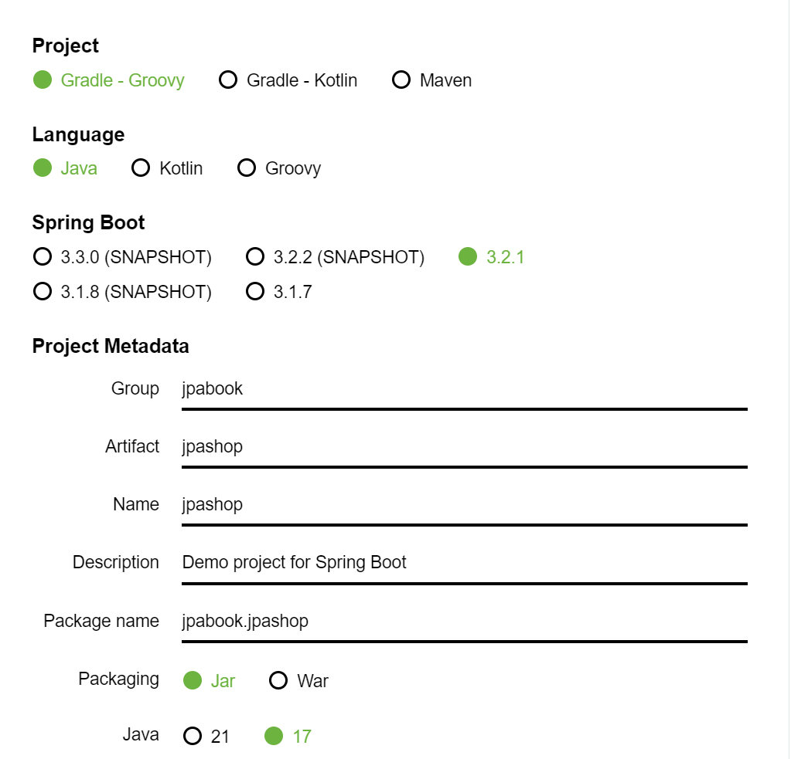
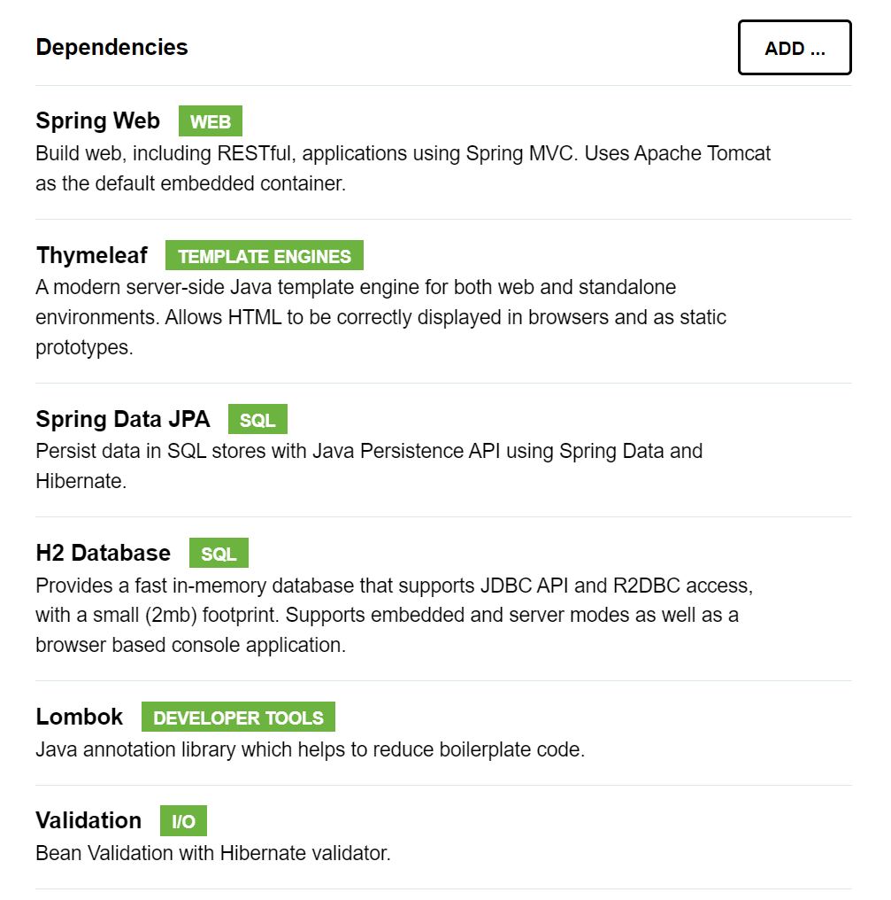
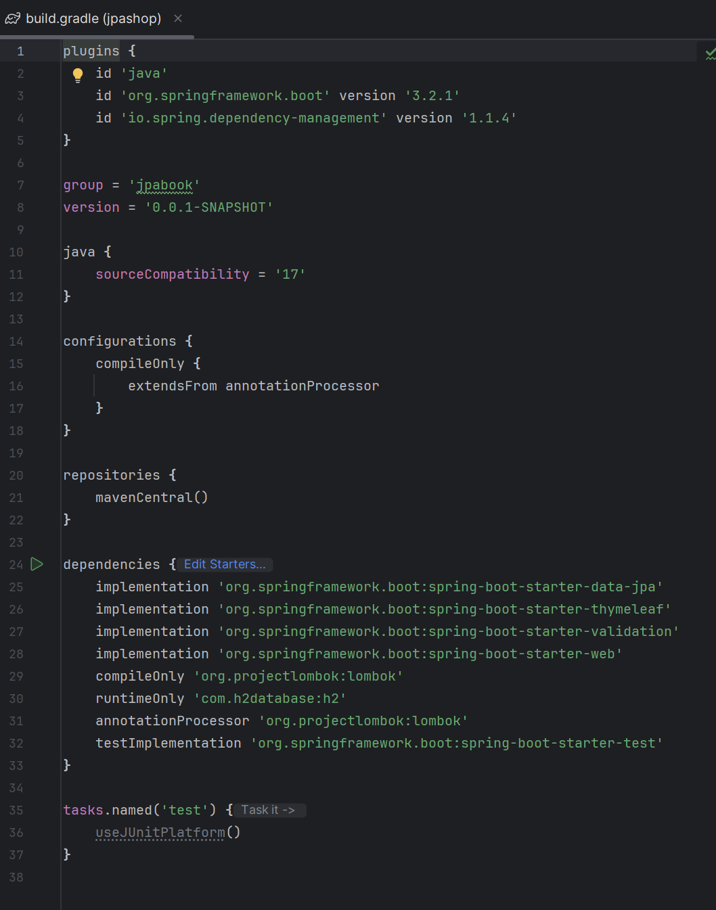
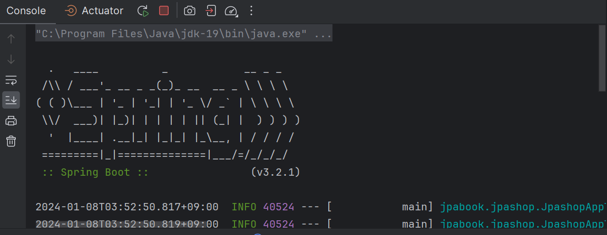
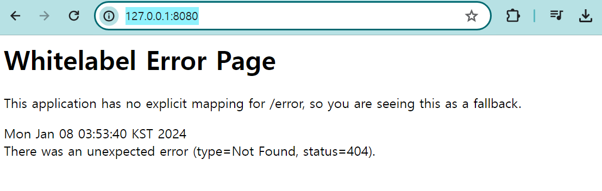
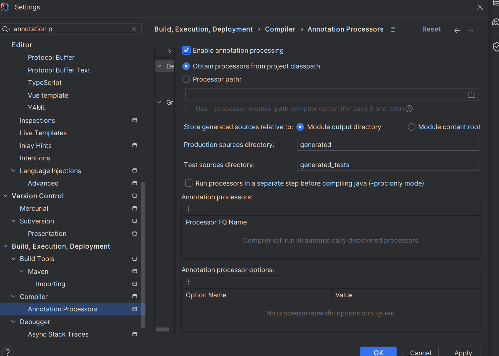

# 프로젝트 생성

- 스프링 부트 스타터 [https://start.spring.io/](https://start.spring.io/)

### 기초 설정






- 설정 후 Generate 클릭하고 원하는 디렉토리로!
- open / import project 로 프로젝트 불러오기
- 처음 시작할 때는 built.gradle로 열기!

### built.gradle 살펴보기

- 플러그인 : 라이브러리 버전 정리까지 해준다 ~~
- 우리가 스타터에서 생성해준 것 다 정리되어 있음



`JpashopApplication` 파일 실행 시 이렇게 실행된다!



- [http://127.0.0.1:8080/](http://127.0.0.1:8080/) 에서 실행됨을 알려줌!


- 아직 아무것도 안해서 이런 창이 뜹니다!



`JpashopApplicationTests` 테스트 파일 실행해보면 잘 작동하는지 확인

+) 오류 발생

- 찾아본 답안!
해당 오류는 JDK 1.8 버전 이후에 추가된 기능으로, 클래스 로딩 시 Class Data Sharing(CDS) 기능을 사용하면 발생합니다. 이 오류는 경고 메시지이며, 어플리케이션에 직접적인 영향을 주지는 않습니다.
하지만 이 오류를 없애려면 다음과 같은 방법이 있습니다.

1. Xshare:off 옵션을 사용하여 CDS 비활성화
2. 클래스 로딩 전에 CDS를 직접 사용하여 미리 클래스 정보 공유파일을 생성하여 사용

해당 오류는 어플리케이션 구동에 직접적인 영향을 미치지 않기 때문에 일단은 무시하셔도 됩니다. 하지만 성능 개선을 원하실 경우 위의 방법을 시도해보시면 좋을 것 같아요.

### lombok은 플러그인을 깔아야한다..

- settings > plugin 검색 > lombok 체크

- settings > annotaion processors > enanle annotation processing 선택



### lombok 동작 확인

- `jpabook.jpashop` 패키지에 Hello 클래스 추가

- @Getter @Setter 달아주면 ⇒ 따로 설정해주지 않아도 setData getData 가능

```java
// Hello.class
package jpabook.jpashop;

import lombok.Getter;
import lombok.Setter;

@Getter @Setter
public class Hello {
    private String data;
}
```

`JpashopApplication`

```java
@SpringBootApplication
public class JpashopApplication {
	public static void main(String[] args) {

		Hello hello = new Hello();
		hello.setData("hello");
		String data = hello.getData();
		System.out.println("data = " + data);

		SpringApplication.run(JpashopApplication.class, args);
	}

}

// 결과
data = hello
```