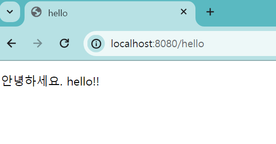
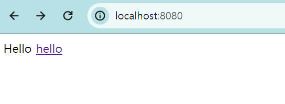

# View 환경설정

thymeleaf 템플릿 엔진 : [https://www.thymeleaf.org/](https://www.thymeleaf.org/)

- 마크업을 깨지않고 사용할 수 있다!
- 참고 사이트
    - 튜토리얼 [https://spring.io/guides/gs/serving-web-content/](https://spring.io/guides/gs/serving-web-content/)
    - 메뉴얼  [https://docs.spring.io/spring-boot/docs/2.1.6.RELEASE/reference/html/](https://docs.spring.io/spring-boot/docs/2.1.6.RELEASE/reference/html/)
      boot-features-developing-web-applications.html#boot-features-spring-mvc-template-engines

### `jpabook.jpashop`패키지에 HelloController 클래스 생성

- @GetMapping("hello") : hello란 url로 오면 이 컨트롤러가 호출된다!
- Model : 스프링 UI에 있는 model => 컨트롤러에서 데이터를 싫어서 view에 넘길 수 있음
- data라는 key에 hello!! 라는 값을 넘길 것
- return  : 화면 이름 > resource/templates/hello.html

```java
package jpabook.jpashop;

import org.springframework.stereotype.Controller;
import org.springframework.ui.Model;
import org.springframework.web.bind.annotation.GetMapping;

@Controller
public class HelloController {
// hello란 url로 오면 이 컨트롤러가 호출된다!
@GetMapping("hello")
// Model : 스프링 UI에 있는 model => 컨트롤러에서 데이터를 싫어서 view에 넘길 수 있음
// data라는 key에 hello!! 라는 값을 넘길 것
// return  : 화면 이름 > resource/templates/hello.html
public String hello(Model model){
model.addAttribute("data", "hello!!");
return "hello";
}
}
```

### resource/templates/hello.html 파일 생성

- thymeleaf로 인하여 서브사이드 렌더링 ⇒ 안녕하세요 손님이 아니라 data를 받아 작성

```html
<!DOCTYPE html>
<html xmlns:th="https://www.thymeleaf.org">
<head>
    <title>hello</title>
    <meta http-equiv="Content-Type" content="text/html; charset=UTF-8" />
</head>
<body>
<p th:text="'안녕하세요. ' + ${data}">안녕하세요. 손님</p>
</body>
</html>
```

  결과 화면

  

### 렌더링 안하고 순수하게 뿌리는 방법!!

static/index.html 생성

```html
<!DOCTYPE HTML>
<html xmlns:th="http://www.thymeleaf.org">
<head>
<title>Hello</title>
<meta http-equiv="Content-Type" content="text/html; charset=UTF-8" />
</head>
<body>
Hello
<a href="/hello">hello</a>
</body>
</html>
```

  

  꿀팁

  build.gradle에 `implementation 'org.springframework.boot:spring-boot-devtools'` 추가 시 코드 변경 후 build>recomplie만 하면 바뀐다…!