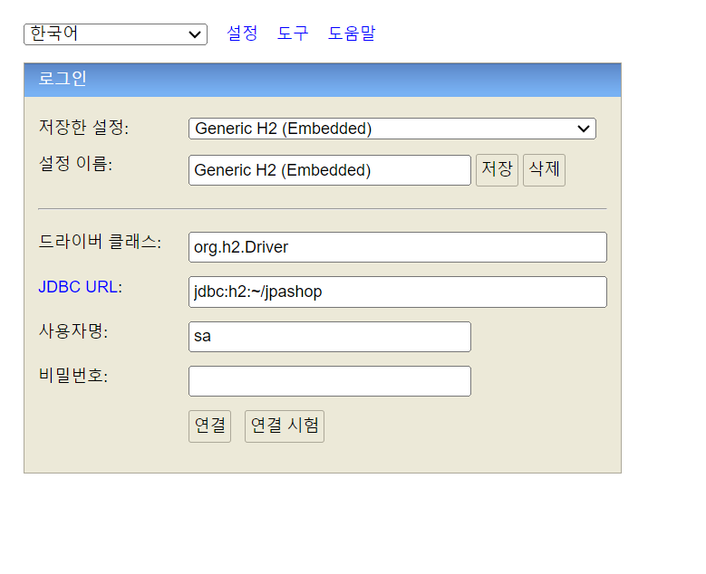
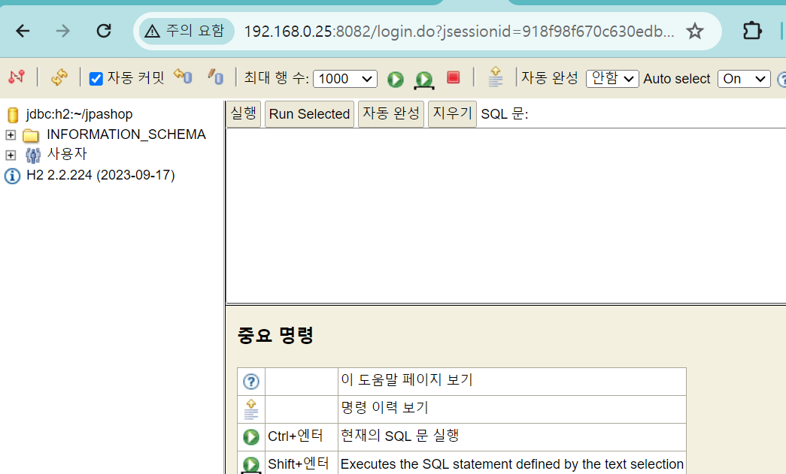
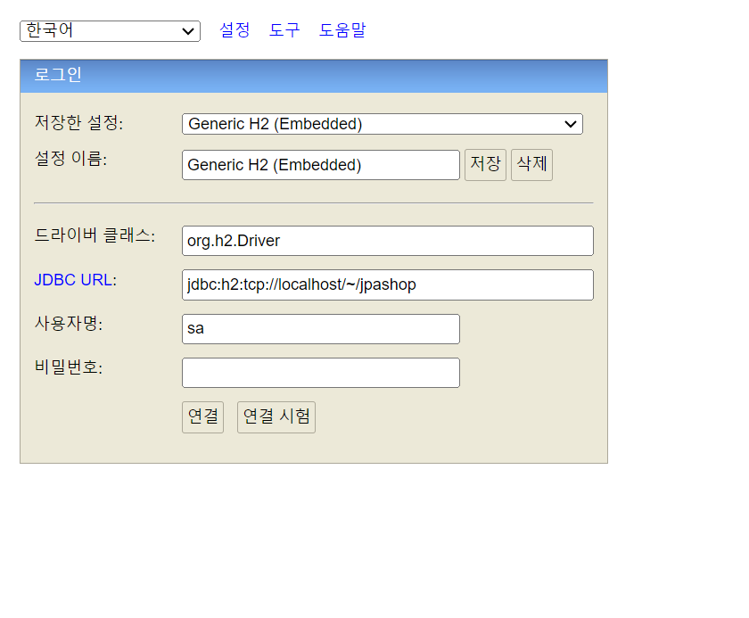

# H2 데이터베이스 설치

[https://www.h2database.com/html/main.html](https://www.h2database.com/html/main.html) 다운

- **[http://localhost:8082](http://localhost:8082/)** 접속 혹은 C:\Program Files (x86)\H2\bin 에서 h2 파일 실행하면 된다 !
- jdbc:h2:~/jpashop (최초 1회, 세션키 유지한 상태로 실행)

  

- ~/jpashop.mv.db 파일 생성 확인 (C:\Users\UserId\에 위치)
    - 좌측 상단 연결 끊기 버튼 있음! 클릭후에는 jdbc:h2:tcp://localhost/~/jpashop로 접속

  

  
