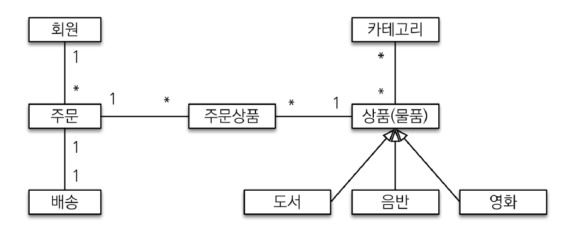
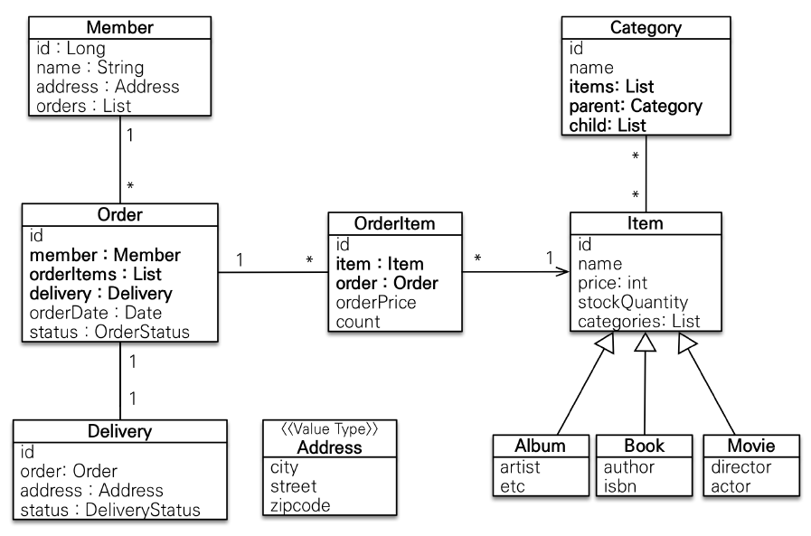
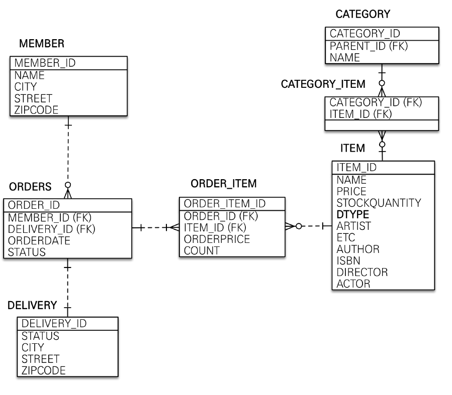

# 02. 도메인 모델과 테이블 설계

- 회원은 여러 상품을 주문할 수 있음
- 한 번 주문할 때 여러 상품을 선택할 수 있음
  - 주문-상품 : 다대다 관계 => 주문상품을 중개 엔티티로 추가하여 일대다, 다대일 관계
- 상품 분류: 도서, 음반, 영화로 구분 => `상품`이라는 공통 속성 사용하므로 상속 구조로 표현

### 회원 엔티티 분석

1. 회원(Member) : 이름(name), 주소(Address:임베디드 타입), 주문(orders) 리스트
   - 임베디드 타입(복합 값 타입) : 새로운 값 타입을 직접 정의해서 사용
2. 주문(Order) : 상품을 주문한 회원, 배송 정보, 주문 날짜, 주문 상태(주문[order] / 취소[cancel] : 열거형[Enum])
   - 한 번 주문시 여러 상품 주문 가능 => 주문:주문상품 ; 일대다 관계
3. 주문 상품(OrderItem) : 다대다 관계 해소,주문한 상품 정보와 주문 금액, 주문 수량 정보
4. 상품(Item) : 이름, 가격, 재고 수량 => 상품 주문시 재고수량 줄어듦 / 상품의 종류 : 도서, 음반, 영화
5. 배송(Delivery): 주문시 하나의 배송 정보 생성, 주문:배송 ; 일대일 / 여기서 Address 활용함
6. 카테고리(Category) : 상품과 다대다 관계, parent(부모)/child(자식) : 계층구조로 이루어져 있음
7. 주소(Address) : 값 타입, 임베디드 타입

양방향 연결 관계 => 실습을 위함, 실제로는 주문이 회원을 참조하는 것으로 충분함!

### 회원 테이블 분석

1. MEMBER: 회원 엔티티의 Address 임베디드 타입 정보가 회원 테이블에 그대로 들어감, DELIVERY 테이블도 마찬가지
2. ITEM: 앨범, 도서, 영화 타입을 통합해서 하나의 테이블로 만듦 (싱글 테이블 전략) / DTYPE 컬럼으로 타입을 구분
    - ORDER 예약어인 경우가 많아 ORDERS로 많이 사용
    - 싱글 테이블 전략 
      - 테이블을 하나만 사용하여, 구분 컬럼(DTYPE)으로 어떤 자식 데이터가 저장되었는지 구분
      - 자식 엔티티가 매핑한 컬럼은 모두 null을 허용해야함
      - 일반적으로 성능이 잘 나옴
3. CATEGORY_ITEM : CATEGORY와 ITEM의 매핑 테이블

#### 연관관계 매핑 분석
1. 회원-주문 : 양방향 관게(일대다, 다대일) => 연관 관계의 주인을 정해야 함!
    - FK를 가지고 있는 쪽인 일대다 관계에서 `다`가 되는 편
    - 외래 키가 있는 주문을 연관 관계의 주인으로 정하는 것이 좋다 !
    - Order.member를 ORDERS.MEMBER_ID 외래키와 매핑
    - 연관관계 주인 쪽에서 키를 관리(등록, 수정, 삭졔) / 주인이 아닌 쪽은 단순히 조회용으로 사용
2. 주문상품-주문 : 다대일 양방향 관계 
   - OrderItem.order를 ORDER_ITEM.ORDER_ID 외래키와 매핑한다.
   - 외래키가 주문 상품에 있으므로 주문 상품이 연관관계의 주인
   - 주문 상품은 하나의 주문에만 연관관계가 걸림, 하나의 주문은 여러 개의 주문 상품을 가질 수 있음!
3. 주문상품과 상품: 다대일 단반향 관계, OrderItem.item을 ORDER_ITEM.ITEM_ID 외래키와 매핑
   - 주문상품에서 상품을 잘 뽑아가면 된다.
4. 카테고리와 상품: @ManyTOMany를 사용해서 매핑 (실무에서는 금물 !!!)

+) 연관 관계의 주인 : 직관적으로는 중복해서 더 많이 가지고 있는 쪽을 주인으로 설정하는 듯?!