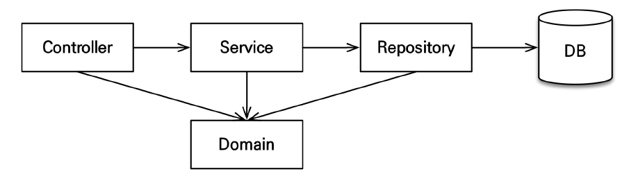

02. 애플리케이션 아키텍쳐

## 계층형 구조 사용
- controller, web: 웹 계층
- service: 비즈니스 로직, 트랜잭션 처리
- repository: 데이터베이스 접근, JPA를 직접 사용하는 계층, 엔티티 매니저 사용
- domain: 엔티티가 모여 있는 계층, 모든 계층에서 사용(참조)

## 페키지 구조
- jpabook.jpashop
  - domain 
  - exception : 공통에외를 모아두었음
  - repository
  - service
  - web
  - 추가로 API 정도?

컨트롤러가 레파지토리에 직접 접근할 수 있도록 유연하게 진행. 대신 단반향으로 !!!   

## 개발 순서
서비스, 리포지토리 계층(웹 환경을 제외한 핵심 비즈니스)을 개발하고, 테스트 케이스를 작성해서 검증, 마지막에 웹 계층 적용