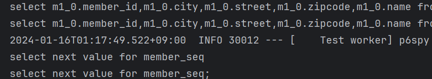
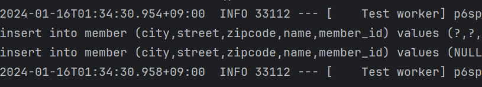
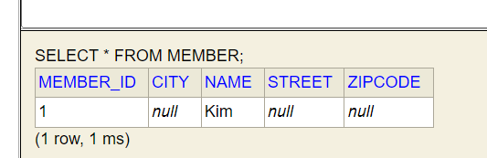
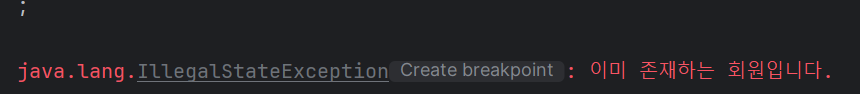
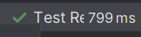
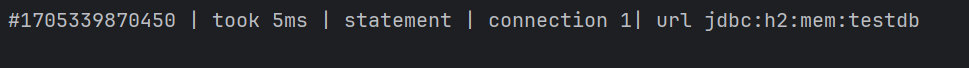

# 회원 기능 테스트
- 테스트 요구사항
  - 회원가입을 성공
  - 회원가입 시 같은 이름이 있다면 예외 발생

```java
package jpabook.jpashop.service;

import jpabook.jpashop.domain.Member;
import jpabook.jpashop.respository.MemberRepository;
import org.junit.jupiter.api.Assertions;
import org.junit.jupiter.api.Test;
import org.junit.jupiter.api.extension.ExtendWith;
import org.springframework.beans.factory.annotation.Autowired;
import org.springframework.boot.test.context.SpringBootTest;
import org.springframework.test.annotation.Rollback;
import org.springframework.test.context.junit.jupiter.SpringExtension;
import org.springframework.test.context.junit4.SpringRunner;
import org.springframework.transaction.annotation.Transactional;

import static org.junit.jupiter.api.Assertions.*;

// 완전히 스프링이랑 인티그레이션을 해서 테스트를 할 예정 : 아래 두 문장이 있어줘야지 할 수 있움
@ExtendWith(SpringExtension.class)
@SpringBootTest
@Transactional
class MemberServiceTest {
    // 테스트 케이스이니까 다른 애들이 참조할 일이 없으므로 간단하게!
    @Autowired MemberService memberService;
    @Autowired MemberRepository memberRepository;

    @Test
//    @Rollback(false)
    // 값(given)이 주어졌을 때(when)이렇게 된다.(then)
    public void 회원가입() throws Exception {
        // given
        Member member = new Member();
        member.setName("Kim");

        // when
        Long saveID = memberService.join(member);

        // then
        // 가입한 것과 찾아온 것이 같아야 정상적으로 회원가입!
        // 같은 트랜젝션 안에서 같은 엔티티 pk 값이 동일하다면 딱 하나로 관리
        assertEquals(member, memberRepository.findOne(saveID));
    }

    @Test
    public void 중복_회원_예외() throws Exception {
        // given
        Member member1 = new Member();
        member1.setName("kim");

        Member member2 = new Member();
        member2.setName("kim");

        // when
        memberService.join(member1);
//        memberService.join(member2); // 여기서 예외가 발생해야한다.
        // 이렇게 작성해주며 터지지 않고 테스트 가능, 더 간단한 방법 존재
//        try {
//            memberService.join(member2);
//        } catch (IllegalStateException e) {
//            return;
//        }

        // 중복 예외가 발생하는 부분
        Assertions.assertThrows(IllegalStateException.class, () -> memberService.join(member2));

        // then : 위에서 예외 발생 여부를 검증하므로 삭재 junit5라..
//        fail("예외가 발생해야 한다.");
    }

}
```

## 회원 가입  TEST 결과
- insert 문이 없음
- persist 한다고 insert문이 나오는 것이 아니기 때문에..! 트랜잭션 커밋과 연결



- Test 아래에 Rollback(false) 달아주면 insert문 볼 수 있음 
```java
@Test
@Rollback(false)
public void 회원가입() throws Exception {
    // given
    Member member = new Member();
    member.setName("Kim");

    // when
    Long saveID = memberService.join(member);

    // then
    assertEquals(member, memberRepository.findOne(saveID));
}
```


- 눈으로 확인해보기



- 오류 발생 : 예외가 튀기 때문


- 터지지 않는 방법1
```java
// 이렇게 작성해주며 터지지 않고 테스트 가능, 더 간단한 방법 존재
try {
    memberService.join(member2);
} catch (IllegalStateException e) {
    return;
}
```

- 터지지 않은 방법 2 in junit5
```java
@Test
public void 중복_회원_예외() throws Exception {
    // given
    Member member1 = new Member();
    member1.setName("kim");

    Member member2 = new Member();
    member2.setName("kim");

    // when
    memberService.join(member1);
    // 중복 예외가 발생하는 부분
    Assertions.assertThrows(IllegalStateException.class, () -> memberService.join(member2));

    // then : 위에서 예외 발생 여부를 검증하므로 삭재 junit5라..
    }
```

- 둘 다 잘 실행되는 것을 알 수 있음
- 


## 기술 설명
- @ExtendWith(SpringExtension.class) :Junit 실행할 때 스프링이랑 같이 실행한다! 스프링과 테스트 통합
- @SpringBootTest : 스프링 부트를 띄우고 테스트하려면 필요! (없는 경우 @Autowired 모두 실패)
- @Transactional : 이 어노테이션이 테스트에서 사용될때는 기본적으로 롤백!, 반복이 가능한 테스트를 지원,
                  각각의 테스트를 실행할 때마다 트랜잭션을 시작하고 **테스트사 끝나면 트랙잭션을 강제로 롤백**


## 테스트 케이스를 위한 설정
테스트 케이스는 격리된 환경에서 실행하고, 끝나면 데이터를 초기화하는 것이 좋다!
- 메모리 DB를 사용하는 것이 인상적임 ~
- ``test/resources/application.yml` 추가
  - jdbc:h2:mem:testdb 로 경로를 변경해주거나 주서거리
  - 스프링부트는 별 다른 설정이 없는 경우 메모리 모드로 돌린디
```yml
spring:
#  datasource: # 데이터베이스 관련 설정
#    url: jdbc:h2:mem:testdb
#    username: sa
#    password:
#    driver-class-name: org.h2.Driver
#
#  jpa: # JPA 관련 설정
#    hibernate:
#      ddl-auto: create # 자동으로 탭을 생성
#    properties:
#      hinernate:
##        show_sql: true # system out으로 나타남
#        format_sql: true
looging.leve: # 로깅 레벨 설정
 org.hibernate.SQL: debug # hibernate SQL를 debug 모드로 쓴다는 것
 org.hibernate.orm.jdbc.bind: trace
# org.hibernate.tyoe: trace

```



- 이제 테스트에서 스프링을 실행하면 이 위치의 설정 파일 읽는다! 없는 경우 기존의 설정 파일
- 스프링 부트는 datasource 없으면 기본적으로 메모리DB 사용
- driver-class도 현재 등록된 라이브러리를 보고 찾아줌
- ddl-auto도 create-drop 모드로 동작
- => 데이터 소스나, JPA 관련된 별도의 추가 설정을 하지 않아도 된다.